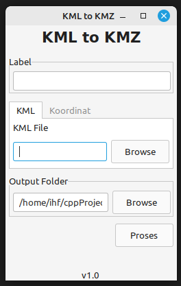
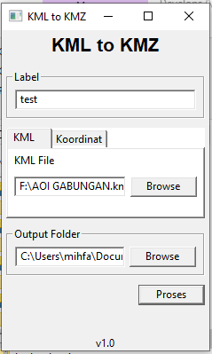

# kml2kmz
GUI tool for converting kml file with multiple coordinates, create kmz for each coordinate. 

### Images
#### Linux



#### Windows


## Requirements

- libarchive

ubuntu user can install it by 

```
apt install libarchive-dev
```

- wxwidgets

ubuntu user can install id by
```
apt install libwxgtk3.2-dev 
```

## Build

```
mkdir build 
cd build
cmake ..
make
```

